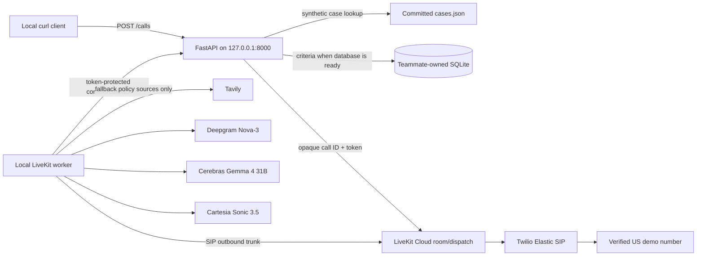

# Hackathon Outbound Coverage Voice Agent

This repository contains a local-demo voice agent that calls a US demo number,
identifies itself as an AI assistant, and discusses published coverage criteria.
The FastAPI service and LiveKit worker run locally; LiveKit Cloud provides rooms
and SIP, while Cerebras, Deepgram, Cartesia, and Tavily are remote services.
Patient context comes only from committed synthetic case fixtures.

The outbound path does **not** use Ollama, EmbeddingGemma, or the existing
`be/docsearch` index. That retrieval experiment remains in the repository as a
separate component.

## What is included

- `be/`: FastAPI API for launching and monitoring one active demo call.
- `be/calling/`: isolated call coordination, fixture-case lookup, LiveKit dispatch, and
  the read-only payer-criteria repository boundary.
- `voice/`: outbound-only LiveKit worker using Cerebras `gemma-4-31b`, Deepgram
  Nova-3, and Cartesia Sonic 3.5.
- `fe/`: unrelated frontend starter; it is not part of the outbound demo path.

The backend retains call state only in memory. It sends no full transcript or
synthetic case payload through its public API. LiveKit Agent Observability is configured
for transcripts only; audio, trace, and log uploads are disabled.

## Architecture



The only LiveKit dispatch metadata is the call ID plus a random capability
token. The worker retrieves the phone number, synthetic patient brief, and
criteria from an internal backend endpoint after it starts.

## Quick start

Prerequisites: Python/`uv`, Homebrew, a LiveKit Cloud project named
`gemma4hackathon`, and a Twilio Trial account with a verified US demo
destination. Do not use real patient data or unverified real-world destinations.

First update the LiveKit CLI if needed. `lk docs` needs version 2.15 or newer.

```bash
brew update
brew upgrade livekit-cli
lk --version
```

The project is already linked. Reauthenticate only if needed:

```bash
lk cloud auth
```

Create local environment files, which are gitignored:

```bash
cd voice
lk --project gemma4hackathon app env --write --destination .env.local .

cd ../be
lk --project gemma4hackathon app env --write --destination .env.local .
```

Merge the provider values from the existing `voice/.env` into
`voice/.env.local`, then fill in the remaining variables described in
[`voice/.env.example`](voice/.env.example) and
[`be/.env.example`](be/.env.example). The Google credential is not used by this
outbound worker.

Install and start the two local processes in separate terminals:

```bash
cd be
uv sync
uv run python -m docsearch.serve
```

```bash
cd voice
uv sync
lk agent dev src/agent.py
```

Launch one synthetic demo call after the backend and worker report ready:

```bash
curl --request POST http://127.0.0.1:8000/calls \
  --header 'content-type: application/json' \
  --data '{
    "to_phone_number": "+12125550123",
    "patient_id": "case-002",
    "payer": "aetna",
    "plan_type": "commercial",
    "drug": "ustekinumab"
  }'
```

The response is `202` and includes a `call_id` and `status_url`. Poll the URL
to follow the lifecycle. Only one call can be active at a time; a concurrent
launch returns `409`.

## Synthetic case selection

The backend does not contact a patient-data service. It loads the committed
synthetic cases in `be/fixtures/cases.json`, keyed by `patient_id`. Keep the
request's payer, plan type, and drug equal to the selected case or preparation
will fail before dialing.

| Case ID | Payer / plan / drug | Demo detail |
| --- | --- | --- |
| `case-001` | Aetna / commercial / ustekinumab | No TB screening recorded |
| `case-002` | Aetna / commercial / ustekinumab | Negative TB screening recorded |
| `case-003` | UHC / commercial / pembrolizumab | No matching committed policy |

To test the full outbound phone path, use the
[fixture-backed synthetic phone-test runbook](be/README.md#fixture-backed-synthetic-phone-test).
It starts a separate allowlisted local backend with a selected synthetic case;
do not run it alongside the regular backend shown above.

## Configuration

The worker loads `voice/.env.local`; the backend loads `be/.env.local`.

Voice requires:

- `LIVEKIT_URL`, `LIVEKIT_API_KEY`, `LIVEKIT_API_SECRET`
- `CEREBRAS_API_KEY`
- `DEEPGRAM_API_KEY`
- `CARTESIA_API_KEY`
- `TAVILY_API_KEY`
- `SIP_OUTBOUND_TRUNK_ID`
- `CALL_BACKEND_URL=http://127.0.0.1:8000`

Backend requires:

- `LIVEKIT_URL`, `LIVEKIT_API_KEY`, `LIVEKIT_API_SECRET`
- `TAVILY_API_KEY` for the location-only infusion-center discovery endpoint
- optionally `PAYER_CRITERIA_DB_PATH` when the teammate-owned SQLite database
  and its schema are available.

The database is intentionally not created or migrated by this project. Until an
adapter is implemented against the teammate's real schema, an unavailable
repository result makes the worker use restricted Tavily search instead.

## Infusion-center discovery

The backend also supports a separate, explicit discovery-to-dial flow for the
hackathon's ZIP `10001`: Tavily returns up to three callable public candidates,
the user selects one, and a `confirm_destination` flag is required before the
normal LiveKit/Twilio call flow begins. The discovery query contains only the
ZIP; it never includes synthetic case or patient context. See the
[backend runbook](be/README.md#find-and-call-an-infusion-center-near-zip-10001)
for the `discover` and `launch --confirm` commands.

## Twilio + LiveKit setup

The existing Twilio `gemma` trunk needs a termination domain and SIP digest
credentials. In Twilio Console:

1. Open **Elastic SIP Trunking → Trunks → gemma**.
2. Assign a unique termination domain, for example
   `gemma4hackathon.pstn.twilio.com`.
3. Create a separate SIP digest Credential List and attach it to the trunk.
   Do not use the Twilio Account SID/Auth Token as SIP credentials.
4. Associate the existing Twilio voice number.
5. Enable only United States Voice geographic permissions.
6. While on a Trial account, verify each US demo destination in Twilio before
   placing a call.

Then create the reusable LiveKit outbound trunk. Substitute the SIP digest
credentials and Twilio voice number; do not put them in source control.

```bash
lk --project gemma4hackathon sip outbound create \
  --name gemma-twilio \
  --address gemma4hackathon.pstn.twilio.com \
  --numbers "$TWILIO_FROM_NUMBER" \
  --auth-user "$SIP_AUTH_USERNAME" \
  --auth-pass "$SIP_AUTH_PASSWORD" \
  --destination-country US
```

Put the returned `ST_...` identifier in `voice/.env.local` as
`SIP_OUTBOUND_TRUNK_ID`. No inbound trunk, origination URI, or inbound dispatch
rule is needed.

In LiveKit Cloud, enable Agent Observability under **Settings → Data and
privacy**. Keep transcript upload enabled and disable audio, trace, and log
uploads. LiveKit documents a 30-day observability retention period.

## Safety and demo behavior

- The API binds only to `127.0.0.1` and deliberately has no user authentication
  for this hackathon demo.
- The backend validates US E.164 destinations, but Twilio still enforces Trial
  verification and carrier rules.
- The backend reads only committed synthetic cases from `be/fixtures/cases.json`.
  It fails before dialing when a case ID is unknown, malformed, or mismatched
  with its payer, plan type, or drug.
- The agent waits for answering-machine detection before it speaks. It proceeds
  only for human or uncertain classifications; voicemail, unavailable mailboxes,
  and IVRs end without a message.
- Voice-policy Tavily queries contain payer, plan, drug, and policy terms
  only—not synthetic case context—and are limited to official payer domains
  plus `cms.gov`. Backend facility-discovery Tavily queries contain only the
  requested ZIP code.
- This is coverage-criteria research support, not a clinical recommendation or
  automated prior-authorization decision.

## Tests

```bash
cd be && uv run pytest
cd voice && uv run pytest
```

The suites use fakes and do not require provider credentials. Before the demo,
manually test human, voicemail, IVR, silence, and unavailable-mailbox AMD paths
with verified demo numbers. Cerebras Gemma is not on LiveKit's evaluated AMD
model list, so this manual check is required.

## License

MIT. See [LICENSE](LICENSE).
