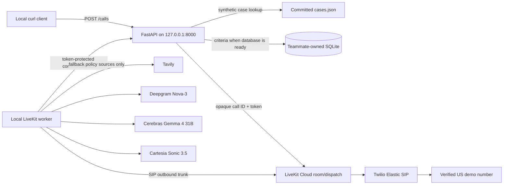

# Conduit

A prior-authorization copilot for billing specialists. It reads the payer's own
published coverage policy, checks a patient record against it before anything is
submitted, and hands the specialist a citation-backed receipt for the result.

Gemma does the reading. EmbeddingGemma indexes the policy corpus and Gemma 4
runs the qualification, both on the specialist's own machine through Ollama,
with no API key and no network call. When a payer approves, a voice agent phones
the infusion center and books the appointment.

The pitch in one line: the payer's own policy, checked before the payer sees the
request, with the receipt to prove it.

## Why this exists

A prior-authorization denial is usually not a clinical disagreement. It is a
missing sentence. The policy asked for a 14 week trial of a preferred
biosimilar, the record documents 9 weeks, and nobody catches it until the payer
does, three weeks later. Conduit catches it in about twenty seconds and cites
the page it came from.

The product turns on the difference between two ways a criterion can fail:

- `NOT_MET` means the record contradicts the requirement. A 9 week course
  against a 14 week floor. The case stops before submission.
- `UNKNOWN` means the requirement is undocumented. The case goes to a human.

Conflating those is what makes automated prior-auth tools untrustworthy. A
contradiction is a fact about the record. An omission is a question for a
person.

## What actually runs

Being specific, because some of this is live and some is not.

| Component | Status |
|---|---|
| Policy retrieval over the corpus | Live. EmbeddingGemma, on device, keyless. |
| Qualification against policy text | Live Gemma 4 available, deterministic path by default. See below. |
| Scoring and banding | Always computed in code, never by a model. |
| Evidence receipts | Live, hashed against the source document. |
| Payer decision after submit | Simulated on a timer. |
| Infusion center search and slot hold | Live against the committed fixtures. |
| The booking phone call | Simulated in the copilot flow. The subsystem under it is real. |

`be/copilot/qualify.py` carries both qualification paths. The live one retrieves
policy excerpts, streams Gemma 4's reasoning as it arrives, and resolves the
excerpt numbers the model cites into real page references. It works and the
citations are correct. It is off by default (`qualify.LIVE = False`) because the
model does not reliably surface the step-therapy criterion the first demo case
depends on, and a determination that quietly drops the criterion it was built to
catch is worse than one that is reproducible. Set `LIVE = True` to qualify
against the model. Everything downstream is identical either way.

## Quick start

Python 3.12 and [uv](https://docs.astral.sh/uv/). The copilot needs no API keys.

```bash
cd be
uv sync
uv run python -m docsearch.index      # build the policy index, about 16s, offline
uv run python -m docsearch.serve      # 127.0.0.1:8000
```

`serve.py` imports `calling.router` absolutely, so run everything from `be/`.

```bash
curl -s localhost:8000/copilot/patients | python3 -m json.tool | head
curl -N -X POST localhost:8000/copilot/patients/pt-dana/qualify
curl -s localhost:8000/copilot/health
```

Live qualification needs Ollama holding `gemma4:e4b` and `embeddinggemma`. Tests
run in any checkout with no Ollama and no network:

```bash
cd be && uv run pytest -q
```

## The copilot API

Everything the dashboard needs sits under `/copilot`, on the same FastAPI app
that serves `/search`.

```
GET  /copilot/patients                -> { active: Card[], completed: Card[] }
GET  /copilot/patients/{id}           -> Card & { record, result, call, events }
POST /copilot/patients/{id}/qualify   -> text/plain stream of the reasoning
POST /copilot/patients/{id}/submit    -> {action: "submit" | "do_not_submit"}
POST /copilot/patients/{id}/schedule  -> books an appointment by agent call
POST /copilot/patients/{id}/events    -> append to the timeline
GET  /copilot/evidence/{id}           -> the determination receipt
GET  /copilot/health                  -> {gemma, search}
POST /copilot/reset                   -> wipe and reseed
```

A patient moves through a tracked pipeline: `intake`, `policy_matched`,
`qualifying`, `review`, `submitted`, `payer_decision`, `scheduling`, `calling`,
`booked`, with `not_qualified` and `payer_denied` as the other two endings.
Every stage change appends an event, so the case reads like a delivery tracker
rather than a form.

Two steps are always human: submitting to the payer, and booking the
appointment. Several states prohibit automated prior-authorization
determinations, so those gates are the compliance posture and nothing bypasses
them.

## Scoring

Four required criteria at 20 points, four supporting at 5, to 100. Other counts
normalize, with the required pool at 80 split evenly and supporting at 20.

- `QUALIFIES` is 85 or above with every required criterion met.
- `NOT_QUALIFIED` is any required criterion contradicted, or a score under 60.
- `NEEDS_REVIEW` is everything else, including any required criterion left
  undocumented.

The model reports one status per criterion and nothing else. The arithmetic runs
in `be/copilot/score.py`, so the same record always produces the same result and
no coverage judgement is carried by generated text.

A record where nothing could be determined either way routes to review whatever
the score. Closing a case on points alone, when the only reason the points are
low is that the chart is thin, would be an adverse determination no human saw.

## Evidence receipts

Every determination gets a permalink. The receipt carries the band, the score,
the rule that produced it, each criterion with its record evidence and the
policy quote behind it, the SHA-256 of the source document, and the line
`Decision support for human review. Not a coverage determination.`

The hash is read from the corpus when the case is seeded rather than copied into
a fixture. A hand-copied hash can drift from the document it claims to quote. A
read one cannot.

## Data and safety

Every patient, provider, and infusion center here is invented. The NPIs are
deliberately invalid: each fails the CMS check digit, so none can collide with a
real provider. Display phone numbers use the reserved 555-01xx range. The only
number the voice agent can dial is one we own, enforced by a destination lock in
the calling harness.

The policy documents are real and public. The quotes on a receipt come from
those documents, and the hash on the receipt identifies the file they were read
from.

Conduit does not diagnose, recommend treatment, or issue coverage
determinations. The pre-submission negative outcome reads "Not submitted -
criteria not met". The word "denied" appears only against an actual payer
decision.

## The calling subsystem

`be/calling/` and `voice/` coordinate a real outbound call. The FastAPI service
and LiveKit worker run locally. LiveKit Cloud provides rooms and SIP, and
Cerebras, Deepgram, and Cartesia are remote services. The voice model is
Cerebras-hosted `gemma-4-31b`, the same family as the on-device work. Patient
context comes only from committed synthetic case fixtures.

The backend keeps call state in memory only. It sends no transcript and no
synthetic case payload through its public API. LiveKit Agent Observability is
configured for transcripts alone, with audio, trace, and log upload disabled.

Placing a real call needs `LIVEKIT_URL`, `LIVEKIT_API_KEY`, and
`LIVEKIT_API_SECRET` in `be/.env.local`, the worker running, and a verified
destination. Without them the copilot's scheduling flow emits the same event
sequence from timers, labeled as simulated, and the tracker behaves identically.

## Repository layout

```
be/copilot/     tracker, scoring, qualification, scheduling
be/docsearch/   policy corpus indexing and search over EmbeddingGemma
be/calling/     call coordination, LiveKit dispatch, synthetic case lookup
be/corpus/      15 payer policy documents across 4 payers, with source hashes
be/fixtures/    synthetic patients, infusion centers, appointment slots
voice/          the outbound LiveKit worker
fe/             the specialist-facing dashboard
```

The policy index holds 528 chunks from 15 documents across UnitedHealthcare,
Anthem, Cigna, and Aetna. It rebuilds offline in about 16 seconds.

## Call architecture



The only LiveKit dispatch metadata is the call ID plus a random capability
token. The worker retrieves the phone number, synthetic patient brief, and
criteria from an internal backend endpoint after it starts.

## Voice agent and real call setup

Prerequisites: Python/`uv`, Homebrew, a LiveKit Cloud project named
`gemma4hackathon`, and a Twilio Trial account with a verified US demo
destination. Do not use real patient data or unverified real-world destinations.

First update the LiveKit CLI if needed. `lk docs` needs version 2.15 or newer.

```bash
brew update
brew upgrade livekit-cli
lk --version
```

The project is already linked. Reauthenticate only if needed:

```bash
lk cloud auth
```

Create local environment files, which are gitignored:

```bash
cd voice
lk --project gemma4hackathon app env --write --destination .env.local .

cd ../be
lk --project gemma4hackathon app env --write --destination .env.local .
```

Merge the provider values from the existing `voice/.env` into
`voice/.env.local`, then fill in the remaining variables described in
[`voice/.env.example`](voice/.env.example) and
[`be/.env.example`](be/.env.example). The Google credential is not used by this
outbound worker.

Install and start the two local processes in separate terminals:

```bash
cd be
uv sync
uv run python -m docsearch.serve
```

```bash
cd voice
uv sync
lk agent dev src/agent.py
```

Launch one synthetic demo call after the backend and worker report ready:

```bash
curl --request POST http://127.0.0.1:8000/calls \
  --header 'content-type: application/json' \
  --data '{
    "to_phone_number": "+13478868173",
    "patient_id": "case-002",
    "payer": "aetna",
    "plan_type": "commercial",
    "drug": "ustekinumab"
  }'
```

The response is `202` and includes a `call_id` and `status_url`. Poll the URL
to follow the lifecycle. Only one call can be active at a time; a concurrent
launch returns `409`.

## Synthetic case selection

The backend does not contact a patient-data service. It loads the committed
synthetic cases in `be/fixtures/cases.json`, keyed by `patient_id`. Keep the
request's payer, plan type, and drug equal to the selected case or preparation
will fail before dialing.

| Case ID | Payer / plan / drug | Demo detail |
| --- | --- | --- |
| `case-001` | Aetna / commercial / ustekinumab | No TB screening recorded |
| `case-002` | Aetna / commercial / ustekinumab | Negative TB screening recorded |
| `case-003` | UHC / commercial / pembrolizumab | No matching committed policy |

To test the full outbound phone path, use the
[fixture-backed synthetic phone-test runbook](be/README.md#fixture-backed-synthetic-phone-test).
It starts a separate allowlisted local backend with a selected synthetic case;
do not run it alongside the regular backend shown above.

## Configuration

The worker loads `voice/.env.local`; the backend loads `be/.env.local`.

Voice requires:

- `LIVEKIT_URL`, `LIVEKIT_API_KEY`, `LIVEKIT_API_SECRET`
- `CEREBRAS_API_KEY`
- `DEEPGRAM_API_KEY`
- `CARTESIA_API_KEY`
- `TAVILY_API_KEY`
- `SIP_OUTBOUND_TRUNK_ID`
- `CALL_BACKEND_URL=http://127.0.0.1:8000`

Backend requires:

- `LIVEKIT_URL`, `LIVEKIT_API_KEY`, `LIVEKIT_API_SECRET`
- `TAVILY_API_KEY` for the location-only infusion-center discovery endpoint
- `DEMO_OUTBOUND_PHONE_NUMBER` for the facility-selection demo call
- optionally `PAYER_CRITERIA_DB_PATH` when the teammate-owned SQLite database
  and its schema are available.

The database is intentionally not created or migrated by this project. Until an
adapter is implemented against the teammate's real schema, an unavailable
repository result makes the worker use restricted Tavily search instead.

## Infusion-center discovery

The backend also supports a separate facility-selection demo for the
hackathon's fixed ZIP `10001`: Tavily returns up to three public candidates,
the user selects an exact cached candidate, and a `confirm_destination` flag
is required before a LiveKit/Twilio call to the configured verified demo number
begins. The selected facility is private agent context only; it is never
dialed. The discovery query contains only the ZIP; it never includes synthetic
case or patient context. See the
[backend runbook](be/README.md#find-an-infusion-center-near-zip-10001-and-run-the-demo-call)
for the `discover` and `launch --confirm` commands.

## Twilio + LiveKit setup

The existing Twilio `gemma` trunk needs a termination domain and SIP digest
credentials. In Twilio Console:

1. Open **Elastic SIP Trunking -> Trunks -> gemma**.
2. Assign a unique termination domain, for example
   `gemma4hackathon.pstn.twilio.com`.
3. Create a separate SIP digest Credential List and attach it to the trunk.
   Do not use the Twilio Account SID/Auth Token as SIP credentials.
4. Associate the existing Twilio voice number.
5. Enable only United States Voice geographic permissions.
6. While on a Trial account, verify each US demo destination in Twilio before
   placing a call.

Then create the reusable LiveKit outbound trunk. Substitute the SIP digest
credentials and Twilio voice number; do not put them in source control.

```bash
lk --project gemma4hackathon sip outbound create \
  --name gemma-twilio \
  --address gemma4hackathon.pstn.twilio.com \
  --numbers "$TWILIO_FROM_NUMBER" \
  --auth-user "$SIP_AUTH_USERNAME" \
  --auth-pass "$SIP_AUTH_PASSWORD" \
  --destination-country US
```

Put the returned `ST_...` identifier in `voice/.env.local` as
`SIP_OUTBOUND_TRUNK_ID`. No inbound trunk, origination URI, or inbound dispatch
rule is needed.

In LiveKit Cloud, enable Agent Observability under **Settings -> Data and
privacy**. Keep transcript upload enabled and disable audio, trace, and log
uploads. LiveKit documents a 30-day observability retention period.

## Safety and demo behavior

- The API binds only to `127.0.0.1` and deliberately has no user authentication
  for this hackathon demo.
- The backend validates US E.164 destinations, but Twilio still enforces Trial
  verification and carrier rules.
- The backend reads only committed synthetic cases from `be/fixtures/cases.json`.
  It fails before dialing when a case ID is unknown, malformed, or mismatched
  with its payer, plan type, or drug.
- The agent waits for answering-machine detection before it speaks. It proceeds
  only for human or uncertain classifications; voicemail, unavailable mailboxes,
  and IVRs end without a message.
- Voice-policy Tavily queries contain payer, plan, drug, and policy terms
  only not synthetic case context and are limited to official payer domains
  plus `cms.gov`. Backend facility-discovery Tavily queries contain only the
  requested ZIP code.
- This is coverage-criteria research support, not a clinical recommendation or
  automated prior-authorization decision.

## Tests

```bash
cd be && uv run pytest
cd voice && uv run pytest
```

The suites use fakes and do not require provider credentials. Before the demo,
manually test human, voicemail, IVR, silence, and unavailable-mailbox AMD paths
with verified demo numbers. Cerebras Gemma is not on LiveKit's evaluated AMD
model list, so this manual check is required.

## License

MIT. See [LICENSE](LICENSE).
